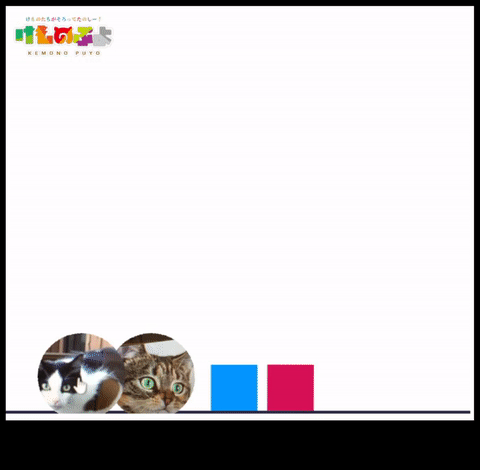
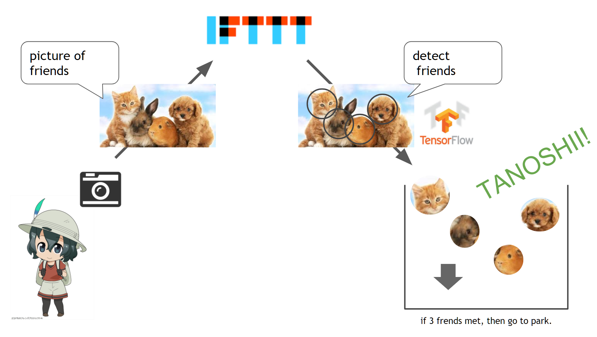

# kemono puyo

Take kemono pictures and lines up, then tanoshii!

This is a toy application that made at the hackathon. It is inspired by following two concepts. 

* [Kemono Friends](https://en.wikipedia.org/wiki/Kemono_Friends)
  * The Kemono Friends is the Japanese animation that the story is like innocent animal character's adventure (`Kemono` means animal in Japanese).
  * `Tanoshii` means so fun! It is the keyword in the Kemono Friends.
* [Puyo Puyo](https://en.wikipedia.org/wiki/Puyo_Puyo)
  * The Puyo Puyo is a puzzle game.
  * It needs 4 Puyos to remove these originally, but I use 3 for simplify

At first I tried to implement the feature to control the falling objects but to see the animal faces is so fun and cute. Because of this, I dropped its implementation.

## Architecture

1. Take picture on your mobile phone etc.
2. Then [IFTTT](https://ifttt.com/discover) sends it to `kemono_puyo` server.
3. `kemono_puyo` detect friends in the picture by [`tensorflow-models/object_detection`](https://github.com/tensorflow/models/tree/master/research/object_detection)
4. Crop the friends faces.
5. Render friends by [Matter.js](http://brm.io/matter-js/)
6. Play friends voice by [HTML5 Audio](https://www.w3schools.com/html/html5_audio.asp)
7. If 3 friends met, they go to park. It is TANOSHII!

Technical Elements summary

* [IFTTT](https://ifttt.com/discover)
* [tensorflow-models/object_detection](https://github.com/tensorflow/models/tree/master/research/object_detection)
* [Matter.js](http://brm.io/matter-js/)
* [HTML5 Audio](https://www.w3schools.com/html/html5_audio.asp)

## Setup

1. git clone `tensorflow/models` on root directory, and make environment to setup it according to the [installation guide](https://github.com/tensorflow/models/blob/master/research/object_detection/g3doc/installation.md).
2. [Download the model weights](http://download.tensorflow.org/models/object_detection/ssd_mobilenet_v1_coco_11_06_2017.tar.gz) to `model_weights` folder and expand it.
3. [Download the label file](https://github.com/tensorflow/models/blob/master/research/object_detection/data/mscoco_label_map.pbtxt) to the same folder (`model_weights/ssd_mobilenet_v1_coco_11_06_2017`).
4. Execute `python run_server.py`

If you want connect mobile phone and `kemono_puyo` server, you have to use IFTTT. If requires global ip, [`ngrok`](https://ngrok.com/) will help you.

The `kemono_puyo` supports websocket, so anyone can participate in it (No Nokemono). Let's take photo for lonely friends!

